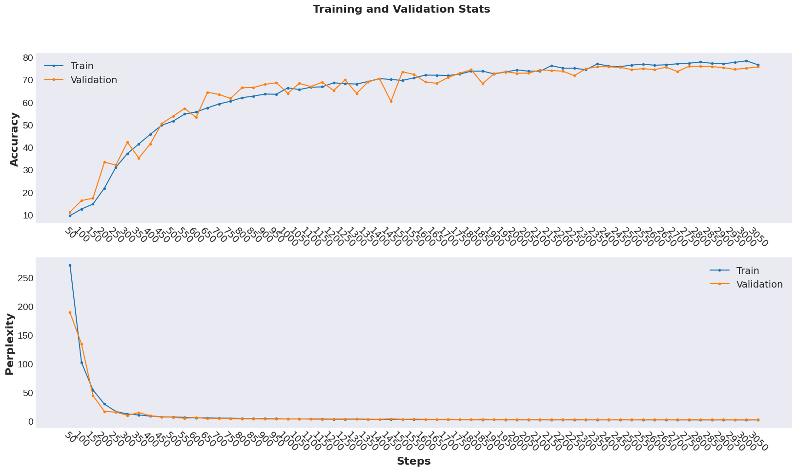
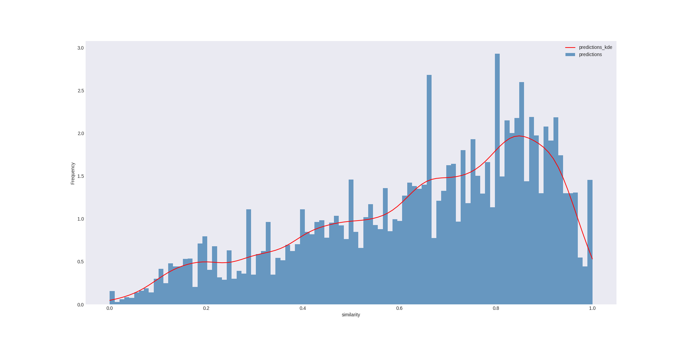

# CquenceR
Automatic Program Repair tool based on Sequence-to-Sequence Learning.

###### The current version patches multi-line and multi-file vulnerabilities.

The tool is based and extends to C programs the original technique called (SequenceR)[https://github.com/KTH/chai].


## Table of Contents

1. [Repository structure](#1-repository-structure)
2. [Setup](#2-setup)   
3. [Usage](#3-usage)
4. [Results](#4-results)
5. [Dataset](#5-dataset)

## Prerequisites

* [Python (>=3.7)](https://www.python.org/)
    * pandas==1.1.4
    * matplotlib==3.3.3
    * numpy==1.19.4
    * scipy==1.5.4
    * python_Levenshtein==0.12.0
    * scikit_learn==0.23.2
    
### Python Dependencies
* [OpenNMT (<2.0)](https://github.com/OpenNMT/OpenNMT-py)

## 1. Repository structure

This repository is structured as follow:


```
├── data: contains the raw, the processed, and the input data use for model, and the trained model.
├── notebooks: contains notebooks explaining the usage 
├── plots: contains plots with descriptive statistics on the raw datasest samples
├── processing: contains scripts for pre-processing of the dataset/samples, and post-processing of the generated sequences
├── test_plots: contains plots describing the testing performance
├── train_plots: contains plots describing the training performance
├── utils: main scripts for commands and relared functions
├── CquenceR.py: main script for running CquenceR's commands
├── Dockerfile: dockerfile to instantiate and run CquenceR in a Docker container
├── init.sh: script to install CquenceR's dependencies 
```

## 2. Setup
This section gives the steps, explanations and examples for getting the project installed.

#### 1) Clone this repo

``` console
$ git clone https://github.com/epicosy/CquenceR.git
```

#### 2) Install dependencies
Execute the ```init.sh``` script, it checks python version, sets `PYTHONPATH`, installs OpenNMT and python 
requirements.

``` console
$ .init.sh
```

## 3. Usage

## Baseline

The baseline usage involves three operations: **preprocess**, **train** and **repair**.

### Preprocess
This operation tokenizes, truncates and transforms the dataset into the input to train the model.
The truncation limit can be changed in the ```CquenceR/config.py``` file.

``` console
$ ./CquenceR.py preprocess -split train_val --src_path 'src_path' --out_path 'out_path'
```

### Train
This operation trains a model from the previous preprocessed dataset files. 
The GPU is not used during training. Uncomment the "'gpu_ranks': 0" line in the ```CquenceR/config.py``` file. 
Make sure you export CUDA_VISIBLE_DEVICES=0.
Check more about GPU usage in the [OpenNMT docs](https://opennmt.net/OpenNMT-py/).

``` console
$ ./CquenceR.py train
```

### Repair
This operation uses the model previously generated to predict fixes and applies them to the source code.
Make sure you supply the manifest path that respects the format (file_path:hunk_start,hunk_end;hunk_start,hunk_end;).
For example: 
``` text
src/accelfunc.c:143,144;
src/accel.c:525,526;
```
The default compiler command must contain the keyword __SOURCE_NAME__, which is replaced with the patched files generated.
The default test command must contain the keyword __TEST_NAME__, which is replaced with the test names. 
These have the format "p#" and "n#" where # is the number of the test case and p is for positive test cases 
and n is for negative test cases. The test that don't pass must raise an error code.

``` console
$ ./CquenceR.py repair --beam_size 50 --compile_script "cb_repair.py compile -wd /tmp/Accel_0 -cn Accel -ifs /tmp/Accel_0/build/Accel/CMakeFiles/Accel.dir/src/accelfunc.c /tmp/Accel_0/build/Accel/CMakeFiles/Accel.dir/src/accel.c -ffs __SOURCE_NAME__" --test_script "cb_repair.py test -wd /tmp/Accel_0 -cn Accel -tn __TEST_NAME__ -ef -np" --working_dir /tmp/Accel_0 --seed 0 --verbose --manifest_path /tmp/Accel_0/Accel/manifest.txt --prefix /tmp/Accel_0/Accel/ --pos_tests 10 --neg_tests 1```
```

## 4. Results

### Training
The network was trained with the same parameters used in *SequenceR* on a Tesla T4 GPU 
on 6,081 samples, and validate it on 716 samples. The training time was 4,000 steps, with an early stopping with 
patience of 10. The total execution time to train the model was 15 minutes, and given the early stopping, the execution 
stopped at 3,050 steps. The best results for both training and validation occur after 2,350 iterations. The accuracy, 
for both training and validation, converges to approximately 80%. The perplexity for the training set converges to 
approximately 2.30 and for the validation to approximately 2.80. 

#### Training and validation accuracy and perplexity


### Testing
The trained model was tested on 358 samples by comparing each prediction 
generated with the target patch, with a beam size of 50, i.e., 50 predictions are made for each sample. The model 
predicted the exact patch for 95 out of 358 vulnerabilities, i.e., 
26.5%. In total, it predicted 17900 patches, being 218 perfect patches. In the original work, it predicts perfect 
fixes for 20% of the cases, using a testing set with 4,711 samples.

#### Histogram of similarity between predicted and target patches


## 5. Dataset

Dataset contains multi line patches from various projects. Check [PatchBundle](https://github.com/epicosy/PatchBundle) 
for more information and details about the dataset.
